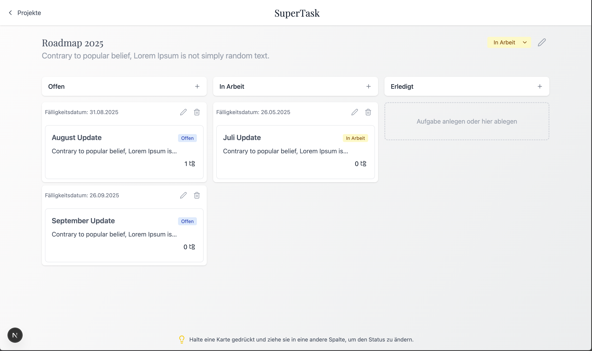

<p align="center">
  
  
  
  
  
  
  
  
  
</p>

# Super-Task

A lightweight single-page app for creating and managing projects, tasks and subtasks.  
Data persists beyond browser sessions via SQLite (default).



---

## 🔥 Features

- Create / edit / delete **projects**  
- Create / edit / delete **tasks** (title, description, due date, status)  
- Create / edit / delete **subtasks** per task  
- Kanban-style **drag & drop** board  
- **Responsive UI** with Tailwind CSS  

---

## ⚙️ Requirements

- Node.js ≥ 18  
- Yarn or npm  

---

## 🚀 Quick Start

1. **Clone the repo**  
   ```bash
   git clone https://github.com/MrGrashopper/super-task.git
   cd super-task
   ```

2. **Install dependencies**  
   ```bash
   yarn install
   ```

3. **Migrate the database & open Prisma Studio**  
   ```bash
    npx prisma migrate dev --name init
    npx prisma studio
   ```

4. **Start the development server**  
   ```bash
   yarn dev
   # or
   npm run dev
   ```

5. **Open the app in your browser**  
   ```bash
   http://localhost:3000
   ```

6. **Optional: Reset the database**  
   ```bash
   npx prisma migrate reset
   ```
---